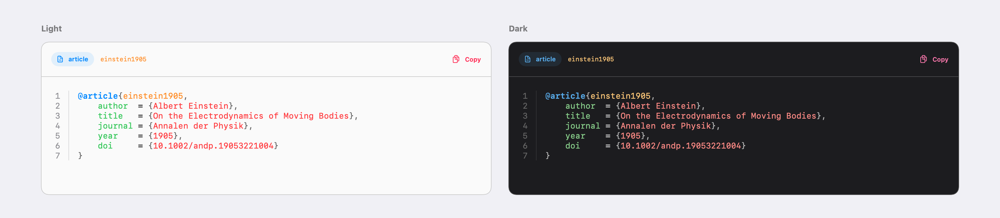
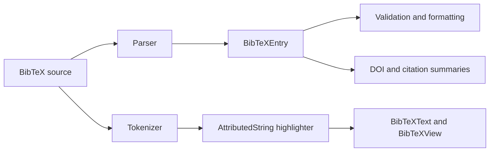

# BibTeXKit

[](https://github.com/ezefranca/BibTeXKit/actions/workflows/build.yml)
[](Package.swift)
[](#requirements)
[](#installation)
[](LICENSE)

Parse, transform, and present BibTeX with native Swift.

BibTeXKit gives Apple-platform applications a pure-Swift bibliography core
with explicit parsing rules, deterministic formatting, and a SwiftUI
presentation layer. It handles real-world BibTeX without networking,
third-party runtime dependencies, or a C compatibility layer.



```swift
import BibTeXKit

let source = """
@article{einstein1905,
    author = {Albert Einstein},
    title = {On the Electrodynamics of Moving Bodies},
    journal = {Annalen der Physik},
    year = {1905}
}
"""

let entries = try BibTeXParser.parse(source)
let titles = entries.compactMap(\.title)
```

## Overview

BibTeXKit keeps the full bibliography workflow in one module:

| Capability | What it provides |
|---|---|
| Parse | Entries, comments, preambles, named strings, concatenated values, nested delimiters, LaTeX, and Unicode |
| Model | Typed `Sendable` values, case-insensitive fields, validation, value-style updates, deterministic formatting, and `Codable` |
| Transform | Iterative LaTeX conversion, DOI extraction and normalization, citation summaries, and syntax tokenization |
| Present | `AttributedString` highlighting and native SwiftUI views with adaptive themes, line numbers, metadata, selection, and copy |
| Distribute | Automatic and dynamic SwiftPM products from one target, plus a release XCFramework built from the same module |

BibTeX is small enough to appear simple and irregular enough to fail at the
edges. Production data combines nested groups, declarations, custom entry
types, malformed records, and text from many writing systems. BibTeXKit gives
those cases one explicit, testable boundary.

## Requirements

| Platform | Minimum version |
|---|---:|
| iOS | 17.0 |
| macOS | 14.0 |
| Mac Catalyst | 17.0 |
| tvOS | 17.0 |
| watchOS | 10.0 |
| visionOS | 1.0 |

BibTeXKit requires Swift 6.3. The package has no third-party runtime
dependencies.

## Installation

The following dependency declaration targets the forthcoming 1.1.0 release.
After its tag is published, add
`https://github.com/ezefranca/BibTeXKit.git` in Xcode, or declare the package
directly:

```swift
dependencies: [
    .package(
        url: "https://github.com/ezefranca/BibTeXKit.git",
        from: "1.1.0"
    )
]
```

### One package, two linkage choices

The root manifest follows a one-target, two-product design. Both products use
the same repository, version, source, module, and public API.

```swift
products: [
    .library(name: "BibTeXKit", targets: ["BibTeXKit"]),
    .library(
        name: "BibTeXKitDynamic",
        type: .dynamic,
        targets: ["BibTeXKit"]
    )
]
```

Choose the product in the consuming target:

```swift
targets: [
    .target(
        name: "YourTarget",
        dependencies: [
            .product(name: "BibTeXKit", package: "BibTeXKit")
        ]
    )
]
```

| Product | Linkage | Use it when |
|---|---|---|
| `BibTeXKit` | Automatic | SwiftPM should choose the appropriate linkage. This is the default. |
| `BibTeXKitDynamic` | Dynamic | The application or framework graph requires a dynamically linked framework. |

Select `BibTeXKitDynamic` in the target dependency to force dynamic linkage.
The imported module remains `BibTeXKit`.

Tagged releases also publish `BibTeXKit.xcframework.zip` for projects that
embed a precompiled framework directly in Xcode. It comes from this repository
and does not require a second package definition. See
[XCFramework distribution](DISTRIBUTION.md) for exact generation, validation,
and integration steps.

## Use BibTeXKit

### Parse untrusted input

Parsing reports malformed structures through `BibTeXParser.Error`. Empty input
throws. A document containing only comments or declarations returns no entries
unless the caller requires at least one.

```swift
import BibTeXKit

func articleTitles(in source: String) throws -> [String] {
    let options = BibTeXParser.Options(
        preserveRawBibTeX: false,
        normalizeFieldNames: true,
        stripDelimiters: true,
        convertLaTeXToUnicode: true,
        requireEntries: true
    )

    return try BibTeXParser.parse(source, options: options)
        .filter { $0.type == .article }
        .compactMap(\.title)
}
```

Use `BibTeXParser.Options.strict` to preserve each entry's raw BibTeX, retain
LaTeX spelling, and require at least one entry.

### Inspect, validate, and update

Common fields have typed accessors. Subscript lookup is case-insensitive.
Entries use value semantics: an update returns a new value and leaves the
original unchanged.

```swift
import BibTeXKit

func addingDOI(
    _ doi: String,
    to entry: BibTeXEntry
) -> BibTeXEntry? {
    guard entry.validate().isValid else {
        return nil
    }

    if let year = entry.year {
        print(year)                   // Int
    }
    print(entry["JOURNAL"] as Any)    // String?

    return entry.with(field: "doi", value: doi)
}
```

`citation(style:)` produces a compact, Markdown-flavored summary. It is not a
CSL processor and does not claim publisher-level style conformance.

### Convert LaTeX and inspect DOIs

```swift
import BibTeXKit

let name = LaTeXConverter.toUnicode(#"M\"uller"#)
let latex = LaTeXConverter.toLaTeX("Müller")

let text = "Available at https://doi.org/10.1000/example."
let doi = DOIDetector.extractDOI(from: text)
let url = doi.flatMap { DOIDetector.doiURL(for: $0) }
```

DOI helpers parse, normalize, and construct resolver URLs. They never perform
a network request.

### Present BibTeX in SwiftUI

```swift
import BibTeXKit
import SwiftUI

struct BibliographyEntryView: View {
    let entry: BibTeXEntry

    var body: some View {
        BibTeXView(entry: entry)
            .preset(.full)
            .bibTeXTheme(AdaptiveTheme())
            .formattingStyle(.aligned)
    }
}
```

`BibTeXText` renders highlighted content without metadata, borders, line
numbers, or copy controls. `BibTeXView` accepts either source text or a parsed
entry and can be configured with `BibTeXViewConfiguration` or focused view
modifiers.

The copy action is available on iOS, macOS, Mac Catalyst, and visionOS. It is
omitted on watchOS and tvOS.

## Architecture



The model and parsing layers are independent of presentation. Applications can
use the complete bibliography core without constructing a view. The parser,
tokenizer, DOI detector, and LaTeX converter use iterative pure-Swift scanners
so hostile nesting does not translate into recursive stack growth.

Entry values canonicalize field lookup while providing total ordering,
equality-consistent hashing, deterministic formatting, and `Codable` round
trips. These properties make exact-output and round-trip tests useful
indicators of semantic drift.

The implementation applies the engineering principles described in
Swift.org's
[migration of TrueType hinting to Swift](https://www.swift.org/blog/migrating-truetype-hinting-to-swift/):
preserve exact output, make ownership and lifetimes explicit, measure
optimization, and use exhaustive coverage. Iterative bibliography scanners are
a BibTeXKit-specific design decision.

## Quality

Behavioral tests use Swift Testing. XCTest remains only for release-mode
`measure` probes. The suite specifies positive, negative, boundary,
error-handling, concurrency, rendering, and regression behavior in
Given/When/Then terms.

The production and core quality gates require 100% line, function, and region
coverage. The current Swift compiler does not emit branch counters for this
package, so reports identify branch coverage as unavailable instead of
substituting another metric. Scheduled mutation testing verifies that
assertions distinguish observable changes in core behavior.

CI treats Swift warnings as errors, runs the complete optimized suite and
three sanitizer configurations, builds both package products for every
supported platform, and validates every XCFramework slice with independent
consumers.

The current source audit records:

| Gate | Result |
|---|---:|
| Optimized tests | 560 passed |
| Production and core coverage | 100% lines, functions, and regions |
| Fresh mutation audit | 1,066 viable mutants killed; 2 compiler-rejected (0.19%); no survivors, timeouts, or uncovered mutants |
| Sanitizers | Address, Undefined Behavior, and Thread Sanitizer passed with no findings |

See [Testing and quality](TESTING.md) for the exact commands, reports,
thresholds, mutation policy, measured results, and known limits. Release-level
changes are recorded in the [Changelog](CHANGELOG.md).

## Performance

Parsing, tokenization, DOI detection, and LaTeX conversion use bounded,
iterative scanners in their hot paths. Output buffers reserve capacity only
where the estimate is safe, and highlighting applies attributes to one
`AttributedString`.

Release-mode probes track parser scaling, tokenization, DOI detection, LaTeX
conversion, and highlighting. They report measurements rather than enforcing
wall-clock thresholds on shared CI hardware. Exact behavior and expected
progress remain deterministic gates.

On an Apple M5 Pro with Xcode 26.6, the warmed Release snapshot averaged
1.58 ms to parse 100 entries, 1.83 ms to tokenize the same workload, and
4.09 ms to extract 1,000 presented DOI links. These figures are directional,
not performance guarantees. See the
[complete measurement protocol and results](TESTING.md#performance-measurements).

## Accessibility, privacy, and security

`BibTeXView` uses semantic SwiftUI text and controls. The copy action has an
accessibility label and hint, decorative line numbers are hidden from
assistive technologies, built-in themes include light and dark variants, and
system text styles participate in Dynamic Type. Syntax remains readable
without color through its original text and line structure.

BibTeXKit contains no analytics, telemetry, persistence, or networking. Input
remains in process. The only system data write is the user-initiated copy
action, which writes the displayed bibliography to the platform pasteboard.

Malformed-input, deep-nesting, and sanitizer tests exercise stack, memory,
arithmetic, and concurrency safety. No finite suite can guarantee execution
under unbounded memory pressure or operating-system termination; applications
that accept remote files should apply limits appropriate to their threat
model.

Report vulnerabilities privately according to the
[Security policy](SECURITY.md).

## Documentation

| Document | Purpose |
|---|---|
| [Testing and quality](TESTING.md) | Local test, coverage, sanitizer, mutation, and CI reproduction |
| [XCFramework distribution](DISTRIBUTION.md) | Source, dynamic, and precompiled integration; release artifact production |
| [Changelog](CHANGELOG.md) | User-visible API, behavior, performance, and compatibility changes |
| [Contributing](CONTRIBUTING.md) | Design, implementation, test, and pull-request standards |
| [Security policy](SECURITY.md) | Supported versions, reporting, and trust boundaries |
| [API quick reference](Agents.md) | Accurate public API guidance for people and coding agents |

## Project

### Support

Use [GitHub Issues](https://github.com/ezefranca/BibTeXKit/issues) for
reproducible defects and focused feature requests. Include the input, expected
behavior, actual behavior, platform, and Xcode version, with sensitive
bibliography data removed.

### Direction

Near-term work is limited to concrete BibTeX interoperability, measured
performance, safety, and Apple-platform integration needs. A complete CSL
engine and network-backed bibliography services remain outside the project
scope unless a focused use case justifies their API and maintenance cost.

### Contributing

Contributions are welcome when they include a clear behavioral case and tests
at the appropriate layer. Read [Contributing](CONTRIBUTING.md) before opening
a pull request.

### License

BibTeXKit is available under the [MIT License](LICENSE).

BibTeXKit is an independent open-source project. It is not affiliated with,
endorsed by, or approved by Apple Inc.
